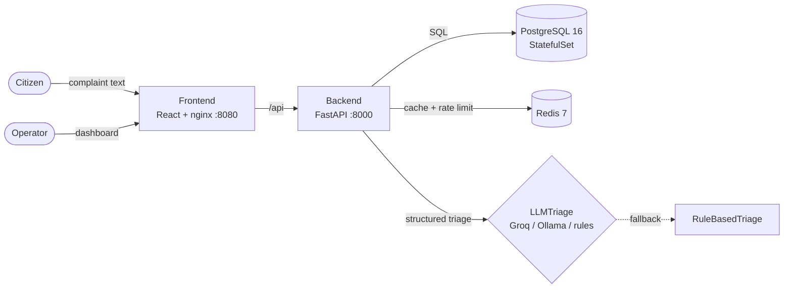

# CivicPulse

> Municipal complaint intake, triage and operations platform — CS4032 Software Construction and Design, Assignment 1.

A citizen submits a complaint; the system validates it, triages it with an LLM (category, priority, one-line summary), persists it in PostgreSQL, and surfaces it on a live operations dashboard with aggregate statistics. Five cooperating containers locally with one command; a scaled, probed, auto-scaling workload on Kubernetes in CI.

## Quickstart

```bash
git clone https://github.com/AliHaiderBajwa/CivicPulse.git && cd CivicPulse
cp .env.example .env        # add your LLM_API_KEY for live triage

# The real backend is being built in `backend/` (see docs/ASHAR-HANDOFF.md).
# Until it lands, the contract stub serves the identical API on the same port:
docker compose -f compose.stub.yaml up -d --wait   # -> http://localhost:8080

# Once `backend/` exists this is the only command you need — same file, no flags:
docker compose up -d --wait
```

Kubernetes, meanwhile, needs no backend at all: `scripts/k8s-up.sh` brings up the
whole stack (including the CRDs, the VPA recommender and the autoscaler) and
smoke-tests the Ingress.

```bash
./scripts/k8s-up.sh         # second command: the whole system on a local k3d cluster
```

## Architecture



## API

| Method | Path | Behaviour |
|---|---|---|
| POST | `/api/complaints` | Validate → triage → persist. 201 · 400 field errors · 429 rate limited |
| GET | `/api/complaints/{id}` | 200 / 404 |
| GET | `/api/complaints` | Filters (category, priority, status) + pagination + total |
| PATCH | `/api/complaints/{id}/status` | State machine; invalid transition → 409 |
| GET | `/api/stats` | Aggregates, Redis-cached 30 s, `X-Cache: HIT\|MISS` |
| GET | `/api/meta/providers` | Active provider + last 20 triage outcomes |
| GET | `/health` | Liveness — never touches the database |
| GET | `/ready` | Readiness — 200 iff Postgres **and** Redis reachable |
| GET | `/metrics` | Prometheus metrics |

_Full contract: `docs/openapi.json` (generated from the backend)._

## Documentation

- `PROGRESS.md` — milestone log (expected / achieved / evidence)
- `docs/RUBRIC-CHECKLIST.md` — one box per rubric line
- `docs/adr/` — architecture decision records
- `docs/RUNBOOK.md` · `docs/ENGINEERING-NOTES.md` · `docs/TRIAGE.md` · `docs/AI-USAGE.md`

## License

MIT
